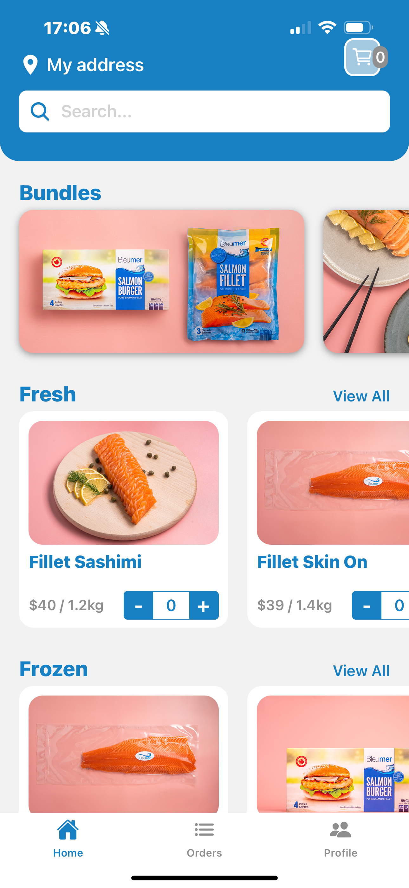
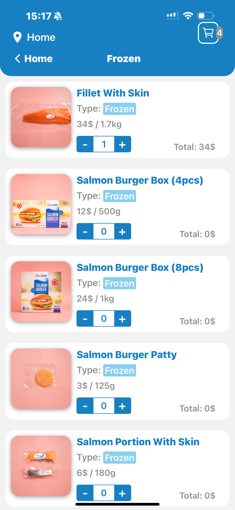
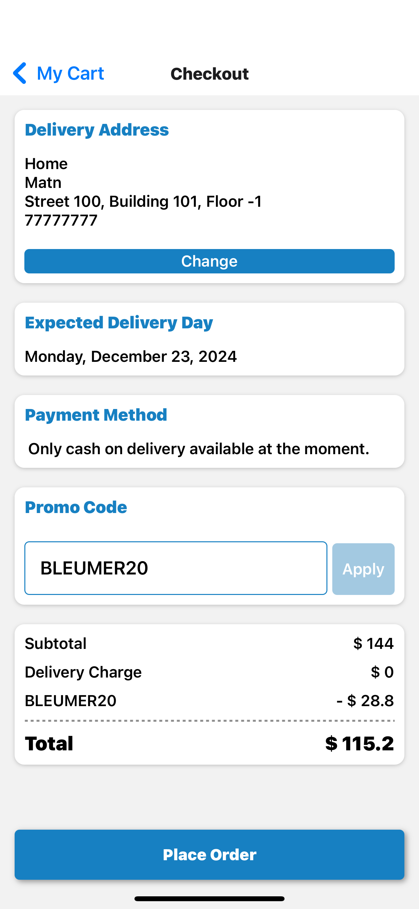
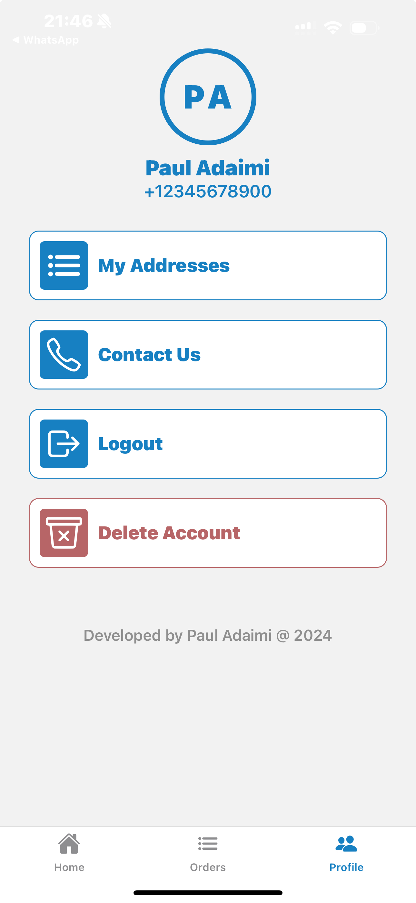

# Welcome to the Bleumer App

This is an [Expo](https://expo.dev) project created with [`create-expo-app`](https://www.npmjs.com/package/create-expo-app).

Download on the [App Store](https://apps.apple.com/vn/app/bleumer/id6738310999)

Download on the [Play Store](https://play.google.com/store/apps/details?id=com.anonymous.bleumer&hl=en_US)

<div style="display:flex">
   
   
   
   
</div>

## Get started

1. Install dependencies

   ```bash
   npm install
   ```

2. Start the app

   ```bash
    npx expo start
   ```

In the output, you'll find options to open the app in a

- [development build](https://docs.expo.dev/develop/development-builds/introduction/)
- [Android emulator](https://docs.expo.dev/workflow/android-studio-emulator/)
- [iOS simulator](https://docs.expo.dev/workflow/ios-simulator/)
- [Expo Go](https://expo.dev/go), a limited sandbox for trying out app development with Expo
